# Ondas electromagneticas 
 

estas ondas no necesitan un medio material para propagarse, pueden propagarse en el vacío y surgen de la interacción entre electricidad y magnetismo como veremos más adelante. Son ejemplos de estas ondas las ondas de radio, de TV, microondas, radiación infrarroja, visible o ultravioleta; Rayos X y gamma.

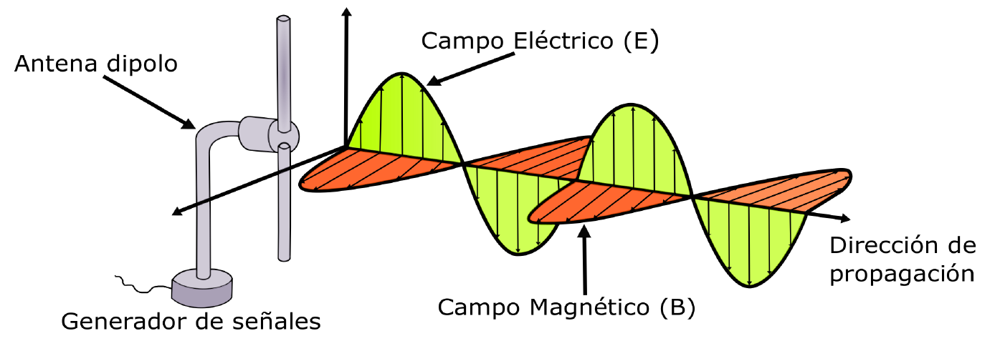

Una OEM puede propagarse en el vacío (a la velocidad de la luz: c = 300,000 km/s) sin necesidad de que exista un medio físico como el aire o el agua para el transporte de energía. Las OEM son tridimensionales (por su número de direcciones de propagación) y transversales.

La idea principal es que si se hace oscilar cargas eléctricas entre los extremos de una antena, se generan un campo eléctrico (E) y un campo magnético (B), que interactúan entre sí. Las OEM son el resultado de la interacción de estos dos campos.

Las OEM son una forma de transportar señales por un medio como ser el aire o por el vacío, de aquí su gran importancia. Se puede emitir una señal desde un transmisor (donde se genera la onda), enviarla hacia una antena transmisora, propagar la onda generada por el aire hacia una antena receptora, en la antena receptora se recibe la onda y se convierte en una señal eléctrica hacia un receptor (donde se recupera la onda). Esta onda contiene información que una vez recibida por el receptor, se puede procesar esa señal y obtener la información que se envió.

Como sabemos, por el aire viajan muchas ondas, ¿Cómo es que las diferenciamos? ¿Cómo es que, de todas las ondas que viajan por el aire la antena receptora distingue la OEM que contiene la información transmitida? Es aquí donde juega el papel más importante una de las características de las ondas: su frecuencia, es esta la característica que permite distinguir las OEM unas de otras.

# Elementos activos y pasivos de antenas de transmisión:

El elemento activo mas importante es el dipolo,
sobre el la radiación electromagnética incidente induce la fuerza electromotriz, que hará circular 
corrientes variables sobre el circuito de radiotelevisión

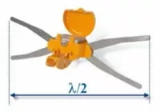

el dipolo varia la longitud dependiendo de la frecuencia que se desean captar.

Idealmente, la anchura del dipolo debría coincidir con la mitad de la longitud de onda de estas frecuencias λ/2.

# Caja de conexión.
Caja donde el dipolo está conectado con el cable conductor del circuito de RTV, el cable coaxial. La conexión se realiza a través del "balum", circuito impreso cuya función es la de adaptar la impedancia de la antena, de alrededor de 300Ω, a la impedancia característica de un circuito de televisión, que es 75 Ω.

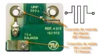

# Emparrillado reflector.
Es un componente pasivo, colocado detrás del dipolo, a 1/4 de longitud de onda aproximadamente, cuya misión principal es la de rechazar señales traseras procedentes de rebotes o de otros repetidores. Además contribuye a aumentar la ganancia de global de la antena.

Tienen una anchura de entre un 3% y un 10% superior a la del dipolo.

# Emparrillado director.
Es un componente pasivo, colocado delante del dipolo, a 1/4 de longitud de onda aproximadamente, cuya misión principal es la de concentrar sobre el dipolo las ondas electromagnéticas incidentes. De esta manera se consigue aumentar la ganancia global de la antena y aumentar su directividad.

Son más cortos que el dipolo y su longitud va disminuyendo según su alejamiento al dipolo o radiador

# Caracteristicas de las antenas:

## Directividad:

Es la capacidad de una antena de absorber las radiaciones incidentes en una determinada dirección del espacio, emitidas desde el repetidor al cual se ha orientado.

" Una alta directividad reduce la captación de señales interferentes y, a su vez, complica el "apuntamiento" de la antena. "

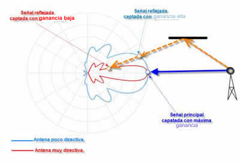

Esta característica define la capacidad de una antena para recibir la señal procedente de una dirección determinada (perpendicular al dipolo) con un valor de máxima ganancia.

La directividad está determinada por otras dos características de las antenas: **El ancho de haz y la relación delante-atrás.**

## Ancho de haz.

Es el ángulo formado por los dos ejes imaginarios de unión de la antena con los puntos donde la ganancia ha disminuido 3 dB respecto a la ganancia máxima, teniendo como bisectriz el eje de máxima ganancia.

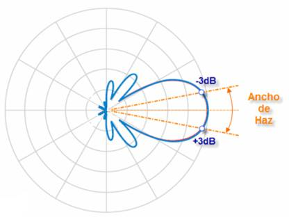

Este ángulo define la zona de radiación de la antena donde la captación de la señal es la adecuada, entre el 70% y el 100% de la ganancia máxima. El ángulo de recepción puede ser horizontal y vertical, identificándose como ancho de haz horizontal y ancho de haz vertical.

## Relación delanteatrás (D/A).

Es la relación entre la ganancia de la antena en la dirección máxima de radiación (lóbulo principal) y la ganancia de la antena en cualquier otra dirección entre 90º y 270º de la dirección de máxima captación.

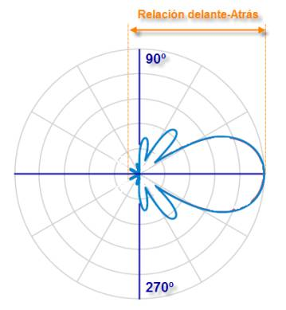

Los fabricantes suelen suministrar este dato respecto a 180º (por detrás) del lóbulo principal.

Una relación delante-atrás grande permite evitar interferencias de repetidores traseros que emitan señales en los mismos canales que los captados por el lóbulo principal de la antena.

## Ganancia:

Es la relación entre la potencia captada por la antena conectada a un circuito de carga y la potencia captada por una antena llamada de referencia o patrón, denominada dipolo elemental, conectada al mismo circuito.

También se puede definir como la relación entre la tensión máxima captada por la antena y la tensión máxima captada por una antena patrón. Este parámetro se puede calcular mediante la expresión:

La ganancia se expresa en dB.

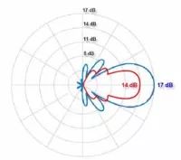

## Ancho de banda

Es el margen de frecuencia dentro del cual la antena mantiene sus características de ganancia, directividad, etc.

También se puede definir como el número de canales que es capaz de captar manteniendo sus niveles de ganancia.

Las casas comerciales sueles especificar el ancho de banda de una antena mediante curvas características.

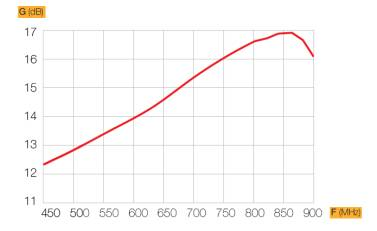

En la gráfica se refleja la ganancia que tiene la antena para la gama de frecuencias en la que puede trabajar, considerando como ancho de banda efectivo aquel en el que la ganancia de la antena disminuye como máximo en 3 dB, desde el valor de ganancia más alto indicado.

## Relación de onda estacionaria (ROE)

Es una medida que expresa el grado de adaptación entre la antena y la impedancia del propio circuito.

La ROE se mejora al colocar el "balum", circuito adaptativo para conseguir una impedancia de 75 Ω de salida, en la caja de conexiones de la antena. De esta manera se consigue una buena adaptación de impedancias.

Si la adaptación de impedancias fuese perfecta, el valor de ROE sería igual a 1, e indicaría que no existen ondas estacionarias o reflejadas, aunque se tiene como valores normales de ROE los comprendidos entre 1,5 y 2,5.

Cuando la ROE es superior a 1 y hay una desadaptación de impedancias, la energía inducida en la antena no es absorbida en su totalidad por el circuito de RTV, originando un "rebote" de onda inducida. Se produce entonces una oposición mayor al paso de la corriente, provocando un descenso del nivel de la señal.

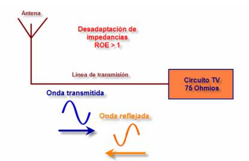

## Antenas terrestres de televisión

Son antenas utilizadas para la captación de señales de televisión emitidas por repetidores terrestres.

Las antenas más empleadas para este servicio son las denominadas antenas Yagi. Estas antenas se ajustan a la descripción de la composición realizadas en el apartado anterior.

Básicamente están constituidas por un dipolo, un emparrillado director en la parte delantera que concentra las señales incidentes en el dipolo, un emparrillado reflector trasero para rechazar señales interferentes y la caja de conexiones.

Como ya se ha especificado, las dimensiones del dipolo, y por lo tanto de la antena, dependen de la frecuencia que se desea recibir. A mayor frecuencia, menor es la longitud de onda y también es menor la longitud del dipolo.

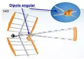.

En la actualidad las emisiones digitales de televisión son todas ellas sobre la banda UHF. La elección de las antenas receptoras de estos servicios es una tarea no trivial, se puede decir que la calidad de la instalación depende tanto de su elección como de la ubicación de estas.

Como contrapartida, la señal digital es una transmisión de umbral, es decir, por debajo de un nivel determinado se deja de recibir el servicio. La ganancia y directividad de la antena deben garantizar una correcta recepción en condiciones marginales.

Las antenas de señales televisión, tienen una ancho de banda amplío, toda la banda UHF generalmente, ya que, como se ha dicho, es aquí donde se concentran este tipo de emisiones.

Las ganancias están en torno a 9 -19 dB, en función de la configuración, teniendo una curva progresiva ascendente, desde valores mínimos a máximos, conforme aumentan las frecuencias de la banda recepcionada.

## Antenas logarítmicas

En este tipo de antenas el emparrillado director lo forman una serie de dipolos de anchura variable, cada uno en resonancia con un canal de TV.

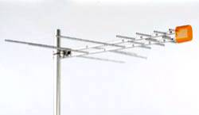

Una antena logarítmica periódica es una antena de banda ancha, con varios elementos activos unidireccionales, cuyas distancias mutuas y frecuencia de resonancia se hallan en progresión geométrica, capaz de recepcionar señales de TV en la banda VHF y UHF y señales de radio FM.

El dipolo activo receptor cambia continuamente dependiendo de la frecuencia, con frecuencias bajas son los elementos más largos los resonantes, y el resto de los elementos actúan como directores. En las frecuencias altas, son los elementos más cortos los que recpecionan y los otros elementos (más largos) actúan como directores.

La ganancia de este tipo de antenas varían entre los 8,5 y 10 dB.

## Antenas panel

Las antenas panel se diseñan para aquellos casos en que se recepcione señal desde varios repetidores y en direcciones cercanas.
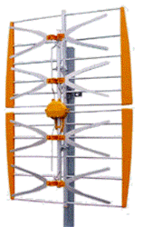

En estos casos la directividad de la instalación receptora no es un parámetro importante, Por lo que no habrá rechazo lateral selectivo de señales rebotadas e interferentes.

Este tipo de antenas están formadas por un número par de dipolos (2 o 4) y un panel reflector. Las recepciones de los dipolos se suman consiguiendo ganancias de aproximadamente 14 dB.

Estas antenas poseen un ancho de banda grande, pudiendo recepcionar la banda UHF completa

## Antenas de elevada ganancia

Son antenas de gran longitud donde la configuración de los emparrillados directores se ha modificado, con una estructura en "V" disponiendo de dos o más parrillas, de tal forma que se consigue aumentar la ganancia final.

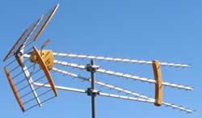

Son antenas especialmente indicadas para la recepción de TV digital terrestre TDT, pues además de la ganancia conseguida tienen una característica de directividad muy alta, lo que estrecha el haz de recepción permitiendo rechazar señales laterales indeseadas.

Su ancho de banda depende del tamaño de dipolo, pero generalmente están configuradas para la recepción con ganancias, progresivamente más elevadas, para frecuencias altas de la banda UHF.